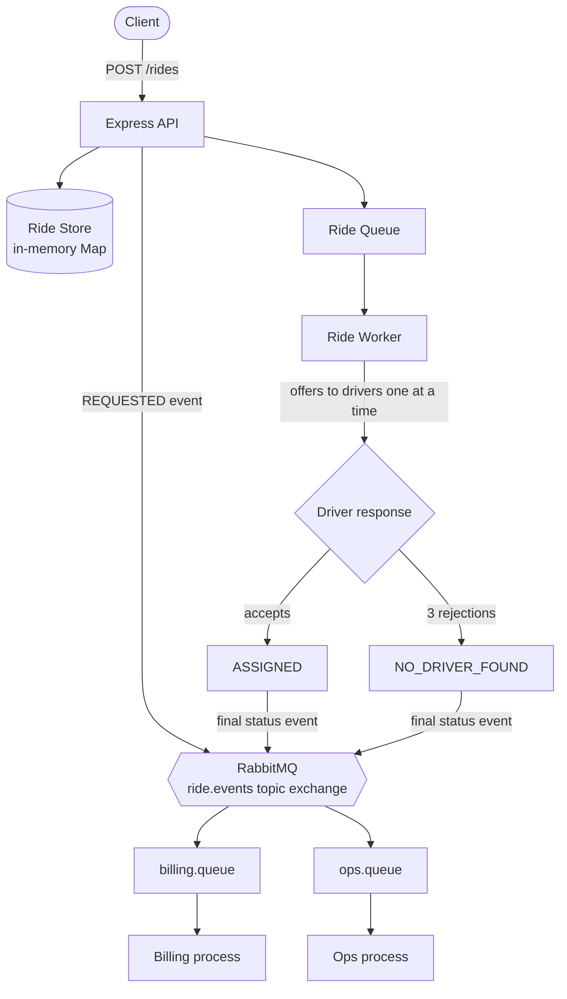
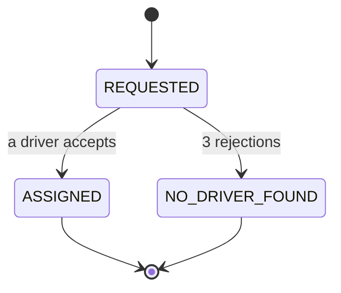
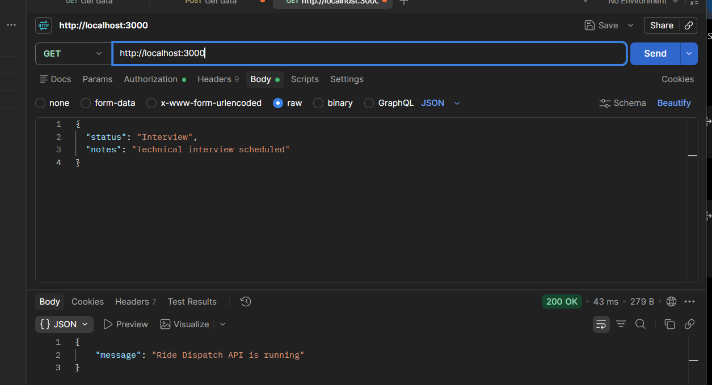
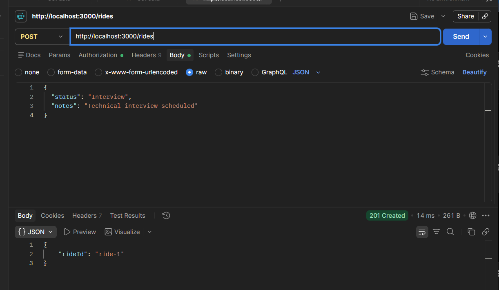
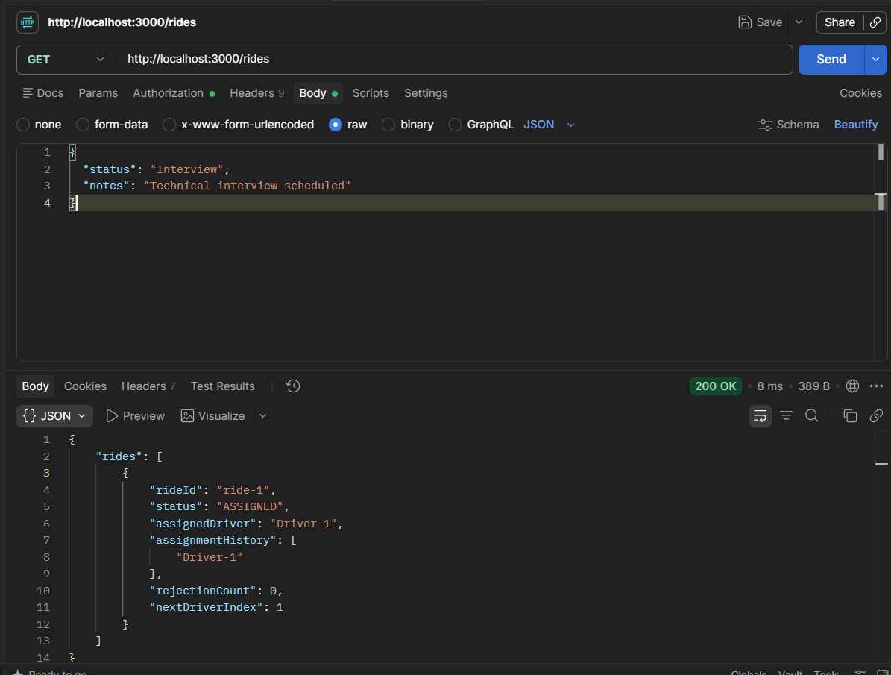
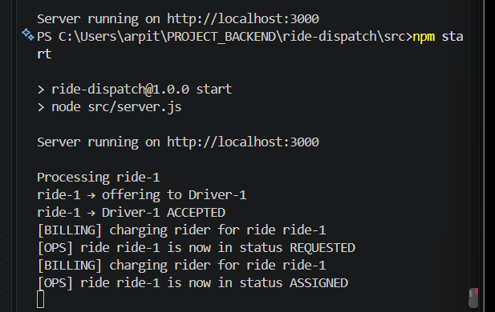
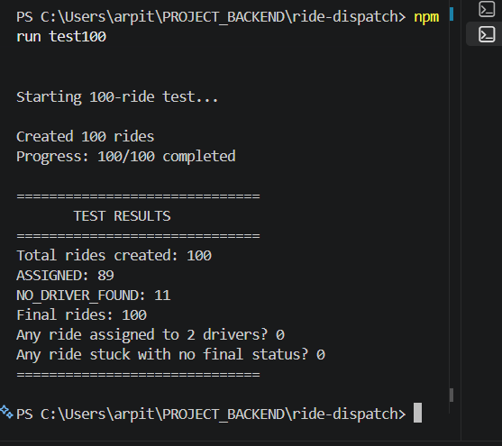
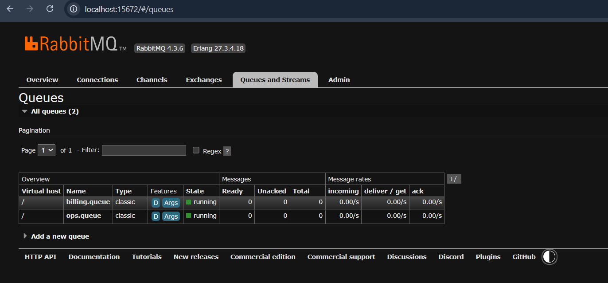

<h1 align="center">🚕 Ride Dispatch System</h1>

<p align="center">
  An asynchronous ride-booking and driver-assignment backend modelled on a simplified Ola/Uber workflow.
</p>

<p align="center">
  
  
  
</p>

Built for an intern backend technical assessment covering async processing, driver assignment, event-driven communication, and concurrent ride handling.

---

## 📑 Table of Contents

1. [What It Does](#-what-it-does)
2. [Architecture](#-architecture)
3. [API](#-api)
4. [Events and RabbitMQ](#-events-and-rabbitmq)
5. [Driver Assignment](#-driver-assignment)
6. [Getting Started](#-getting-started)
7. [Testing 100 Concurrent Rides](#-testing-100-concurrent-rides)
8. [Screenshots](#-screenshots)
9. [Project Structure](#-project-structure)
10. [Design Decisions](#-design-decisions)
11. [Limitations and Production Improvements](#-limitations-and-production-improvements)

---

## ✨ What It Does

- `POST /rides` creates a ride and returns a `rideId` **immediately**.
- The ride is queued and processed in the background by a worker.
- The worker offers the ride to drivers one at a time, and each accepts with ~50% probability.
- First acceptance sets the ride to `ASSIGNED`. Three rejections set it to `NO_DRIVER_FOUND`.
- Every status change is published to **RabbitMQ**, where **Billing** and **Ops** consume it independently.
- A test script fires **100 concurrent rides** and verifies that every one reaches a final state with no duplicate assignments.

---

## 🏗️ Architecture



### Ride Lifecycle



A `REQUESTED` event is published when the ride is created, and another when the worker sets the final status.

---

## 🔌 API

| Method | Endpoint | Description                                     |
| ------ | -------- | ----------------------------------------------- |
| `GET`  | `/`      | Health check                                    |
| `POST` | `/rides` | Create a ride, returns `{ "rideId": "ride-1" }` |
| `GET`  | `/rides` | List all rides currently in memory              |

**Example ride object from `GET /rides`:**

```json
{
  "rideId": "ride-1",
  "status": "ASSIGNED",
  "assignedDriver": "Driver-2",
  "assignmentHistory": ["Driver-2"],
  "rejectionCount": 0,
  "nextDriverIndex": 2
}
```

---

## 🐇 Events and RabbitMQ

Each status change publishes an event like this:

```json
{ "rideId": "ride-1", "status": "ASSIGNED", "assignedDriver": "Driver-2" }
```

### Topology

| Item         | Value                                                     |
| ------------ | --------------------------------------------------------- |
| Exchange     | `ride.events` (topic, durable)                            |
| Routing keys | `ride.REQUESTED`, `ride.ASSIGNED`, `ride.NO_DRIVER_FOUND` |
| Queues       | `billing.queue`, `ops.queue` (both bound with `ride.#`)   |

Each consumer has its own queue bound to the exchange, so **both receive every event** instead of splitting them.

### Consumers

| Consumer   | File                   | Output                                        |
| ---------- | ---------------------- | --------------------------------------------- |
| Billing    | `consumers/billing.js` | `[BILLING] charging rider for ride ride-1`    |
| Operations | `consumers/ops.js`     | `[OPS] ride ride-1 is now in status ASSIGNED` |

### Reliability

- Durable exchange and queues
- Persistent messages with publisher confirms
- Manual ack / nack
- Consumer prefetch of 10
- Message IDs for basic in-process duplicate protection

---

## 🚗 Driver Assignment

- There are 10 hardcoded drivers: `Driver-1` … `Driver-10`.
- Each response is random: `Math.random() < 0.5`.
- Drivers are offered the ride in order, and after 3 rejections the ride becomes `NO_DRIVER_FOUND`.
- `assignmentHistory` records every assigned driver, so the test can prove no ride has two drivers.
- Drivers are simulated and have no availability state, so the same fake driver can serve several rides.

---

## ▶️ Getting Started

### Prerequisites

- Node.js and npm
- Erlang/OTP 27
- RabbitMQ 4.x running at `amqp://localhost` (management UI at `http://localhost:15672`)

### Install

```bash
git clone https://github.com/arpitsingh39/ride-dispatch-system.git
cd ride-dispatch-system
npm install
```

### Run

Start the consumers first, because they create the queues. Use a separate terminal for each:

```bash
# Terminal 1
npm run billing
```

```bash
# Terminal 2
npm run ops
```

```bash
# Terminal 3
npm start
```

The API should print `[BUS] connected to RabbitMQ` and `Server running on http://localhost:3000`.

### Try it

```bash
# Create a ride
curl -X POST http://localhost:3000/rides

# View all rides
curl http://localhost:3000/rides
```

---

## 🧪 Testing 100 Concurrent Rides

With everything running, open a fourth terminal:

```bash
npm run test100
```

The script creates 100 rides at once, polls until all are finished, and checks the invariants below.

```text
==============================
       TEST RESULTS
==============================
Total rides created: 100
ASSIGNED: 92
NO_DRIVER_FOUND: 8
Final rides: 100
Any ride assigned to 2 drivers? 0
Any ride stuck with no final status? 0
==============================
```

`ASSIGNED` and `NO_DRIVER_FOUND` counts vary between runs because driver responses are random. What must always hold:

- `ASSIGNED + NO_DRIVER_FOUND = 100`
- No ride is assigned to more than one driver (checked via `assignmentHistory`)
- No ride is stuck without a final status

---

## 📸 Screenshots

### Health check

<p align="center">
  
</p>

### Create ride

<p align="center">
  
</p>

### Get rides

<p align="center">
  
</p>

### Worker and consumers

<p align="center">
  
</p>

### 100-ride test

<p align="center">
  
</p>

### RabbitMQ queues

<p align="center">
  
</p>

---

## 📁 Project Structure

```text
ride-dispatch-system/
├── consumers/
│   ├── billing.js            # Billing consumer process
│   └── ops.js                # Operations consumer process
├── scripts/
│   └── test100.js            # 100-ride validation test
├── src/
│   ├── events/
│   │   ├── config.js         # RabbitMQ URL and exchange name
│   │   ├── eventBus.js       # Publishes events to RabbitMQ
│   │   └── consumer.js       # Shared consumer helper
│   ├── queue/rideQueue.js    # Sequential in-memory queue, triggers the worker
│   ├── routes/rideRoutes.js  # POST /rides, GET /rides
│   ├── store/rideStore.js    # In-memory Map of rides
│   ├── worker/rideWorker.js  # Driver offers, accept/reject, final status
│   └── server.js             # Express entry point
├── screenshots/
└── package.json
```

---

## ⚙️ Design Decisions

| Decision | Why |
| --- | --- |
| **Immediate API response** | `POST /rides` never waits for assignment, because matching runs in a background worker. |
| **RabbitMQ instead of Node IPC** | The first version forked Billing and Ops with `child_process.fork()`. RabbitMQ lets them run, crash, and restart independently, and queued events wait for them. |
| **One queue per consumer** | A shared queue would split events between Billing and Ops, so each gets its own copy. |
| **Topic exchange** | Routing keys like `ride.ASSIGNED` let a consumer subscribe to only the events it needs. |
| **In-memory storage** | Keeps the focus on async processing, queueing, events, and correctness under concurrency. Data resets on restart. |
| **Sequential worker** | Keeps the flow simple and easy to reason about. |

---

## ⚠️ Limitations and Production Improvements

| Current (assessment)            | Production approach                      |
| ------------------------------- | ---------------------------------------- |
| In-memory `Map`                 | PostgreSQL / MongoDB                     |
| In-process ride queue           | RabbitMQ or Redis + BullMQ               |
| Single sequential worker        | Multiple workers                         |
| Simulated drivers               | Real availability and location tracking  |
| In-process duplicate protection | Persistent idempotency store             |
| No dead-letter queue            | Dead-letter exchange and queue           |
| Local RabbitMQ                  | Managed RabbitMQ                         |
| No auth, basic console logging  | JWT / OAuth, structured logging, metrics |

Also worth adding: ride timeouts, retry policies, request validation, graceful shutdown, and containerization.

---

<p align="center">
  Built with Node.js, Express.js, RabbitMQ, and <code>amqplib</code>.
</p>
